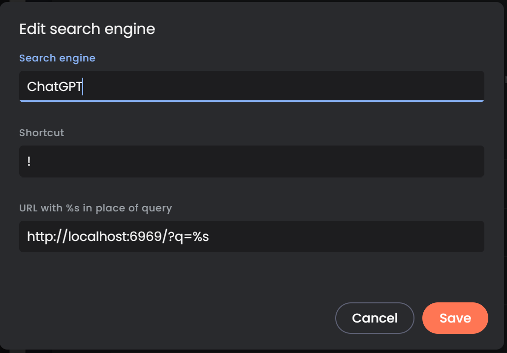

# GPT search
> proompt ChatGPT from your search bar

This is a python script that serves `index.html` and makes requests to ChatGPT via the openai api. to configure it, run the python script, then go to [about:settings](about:settings/searchEngines) on chromium browsers (it has not been tested on firefox) and add a search engine and give it a shortcut




obviously the port depends on whatever it is set to, by default it is `6969`, but you can change it in `server.py` on the line:
```python
app.run(port=6969)
```

you can make the shortcut anything you want

here is how to use it:


<br>

And it will give you a page like this:

<br>


Ironically, I created it with ChatGPT, though it took some more prompting to fix errors. Now, the CSS, i did write...

## Todo
- make it work better

i have tried to figure out a way to run this as a background service, but it is tricky to make the window dissapear and it would take more involved code.

perhaps the better thing would be to throw it up on a free hosting server.

im too lazy to do that, cause this works for me for now.

